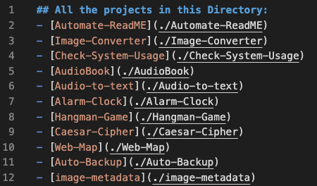
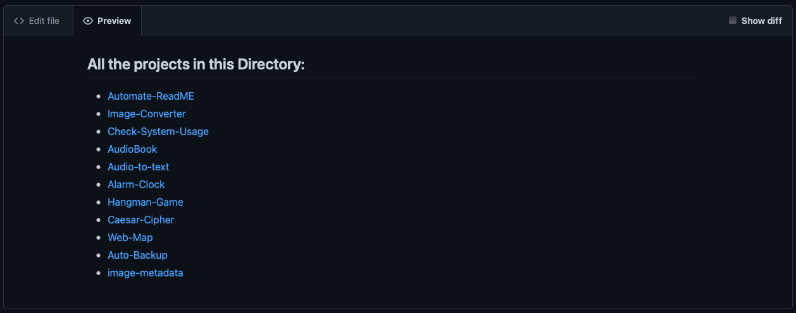

## Automated README generator ##
- This script can be used to update README.md file when there is a new project added to the repository automatically with just a single execution.


#### Work Flow
- Getting all the list of directories in the current working directory.
- Creating the README.md file
- Adding all the directory name to README.md and linking to its location.


###  How to run the scripts
- Place the ```updateREADME.py``` script inside the directory where all the project folders exist
- Update the Header you wanted.
- Run the below scripts using
    ```
      python updateREADME.py
    ```

### Generated README File : 
here is  a demo where updateREADME.py is executed in [scripts](../../scripts) folder. 
##### Raw ReadME file


##### Preview ReadME file


---
[ Sirish C ](https://github.com/SirishC)
Happy coding 🤟